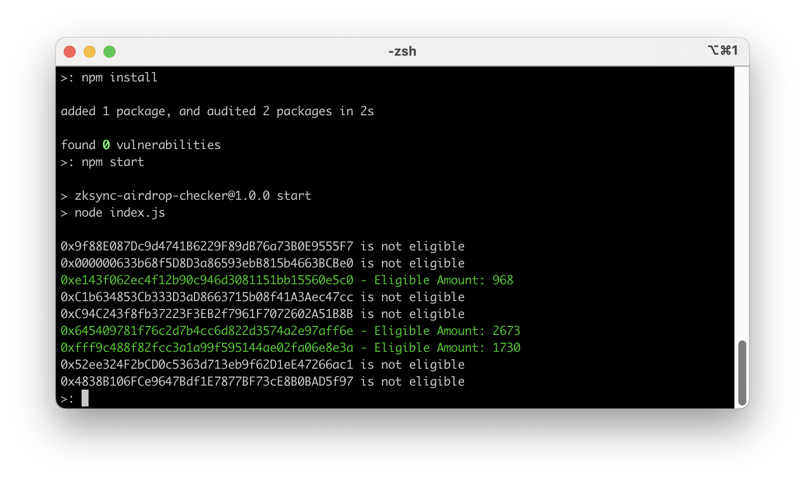

# ZkSync Airdrop Checker



A Node.js tool to verify wallet address eligibility for ZkSync airdrops. This script reads from an eligibility list CSV file and checks against wallet addresses from a text file, logging eligible addresses with their corresponding amounts in green and saving them to `eligible_addresses.txt`.

## Features

- **Super Fast and Efficient**: Provides results in milliseconds due to offline checking.
- Reads eligibility data from a CSV file
- Loads wallet addresses from a text file
- Checks both original and lowercase versions of wallet addresses
- Logs eligible addresses and amounts in green for easy identification
- Saves eligible addresses to `eligible_addresses.txt`

## Prerequisites

- **Node.js**: Ensure you have Node.js installed. You can download it from [Node.js](https://nodejs.org/).

## Installation

1. Clone the repository:
    ```bash
    git clone https://github.com/dmytrmk/ZKsync-Fast-Airdrop-Checker.git
    ```

2. Navigate to the project directory:
    ```bash
    cd zk-sync-airdrop-checker
    ```

3. Install the dependencies:
    ```bash
    npm install
    ```

## Usage

1. Prepare your `wallet_addresses.txt` file with one wallet address per line:
    ```txt
    0x1234...
    0xabcd...
    ```

2. Run the airdrop checker:
    ```bash
    npm start
    ```

    The script will output eligible addresses and their amounts in green and save them to `eligible_addresses.txt`.

## Example Output

If an address is eligible, the script will log:
`0x1234… - Eligible Amount: 100`

## Contributing

Contributions are welcome! Please open an issue or submit a pull request.

## License

This project is licensed under the MIT License. See the [LICENSE](LICENSE) file for details.

## Support

If you encounter any issues, please open an issue on GitHub or contact me on email on my profile.
